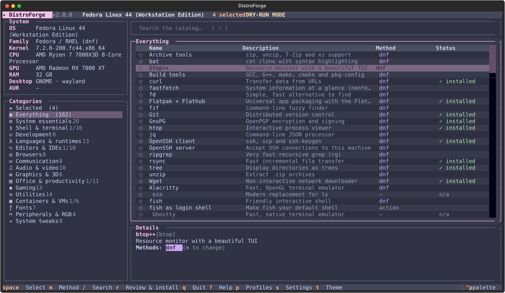
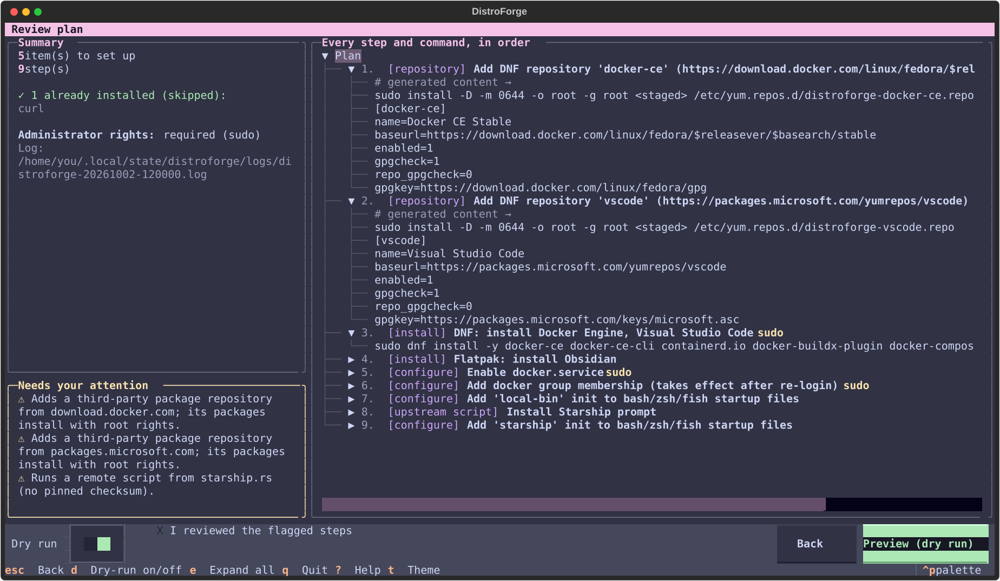
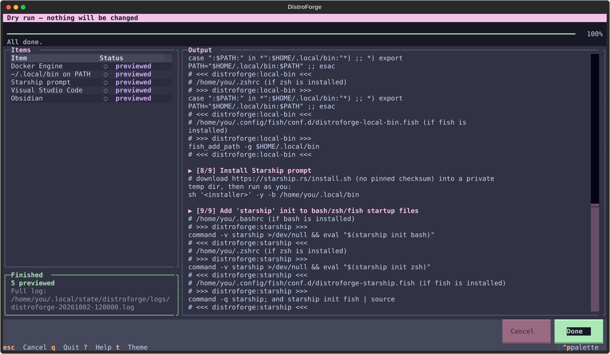
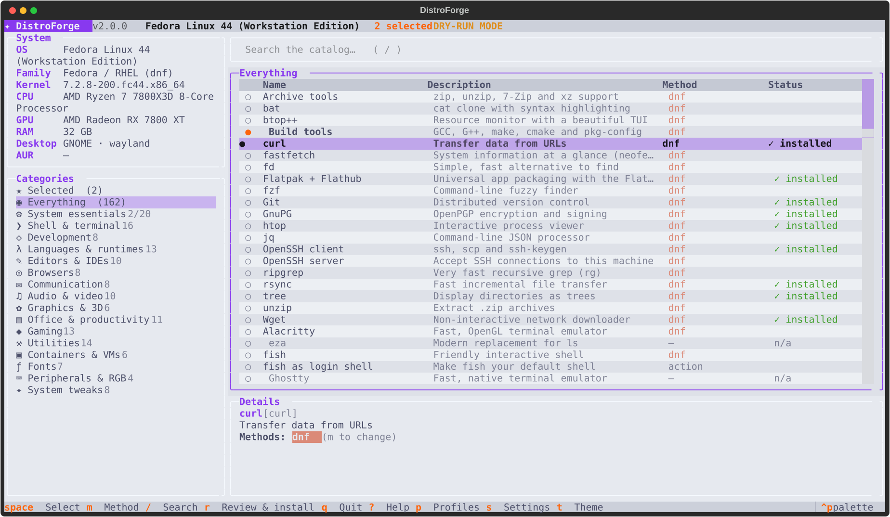
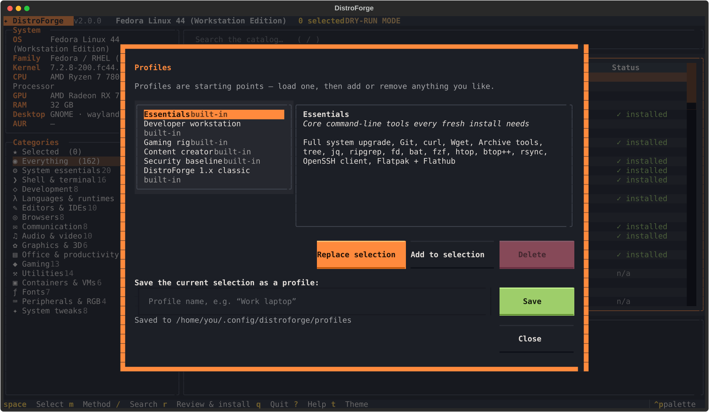

<div align="center">


# DistroForge

**Forge your Linux setup.** A full-screen terminal app for setting up a fresh install on any major distro: pick exactly the apps and tweaks you want, review every command, then let it run.

[](https://github.com/RezaLabsHQ/DistroForge/releases/latest)
[](https://github.com/RezaLabsHQ/DistroForge/actions/workflows/ci.yml)


[](LICENSE)

[Install](#install) · [Using it](#using-it) · [Add your own apps](#add-your-own-apps) · [How it works](#how-it-works) · [FAQ](#faq) · [Contributing](CONTRIBUTING.md)



</div>

## Why DistroForge?

Chris Titus's WinUtil showed how pleasant a "pick what you want, click install" toolbox can be on Windows. DistroForge brings that to Linux, built as a real application rather than a pile of scripts:

- **You choose everything.** Nothing is pre-selected. Browse about 160 apps and tweaks by category, search, select, and switch each item's install method (distro package, Flatpak, AUR or upstream installer).
- **One tool, many distros.** Debian/Ubuntu (apt), Fedora/RHEL (dnf) and Arch (pacman, plus AUR via paru/yay), with Flatpak as the universal fallback. Derivatives such as Mint, Pop!\_OS, Zorin, Nobara, Manjaro, EndeavourOS and CachyOS are detected automatically.
- **See before you run.** The review screen lists every step and the exact command it will execute. Dry-run is one key away.
- **Safe by construction.** Commands are never passed through a shell, all catalog data is validated, and root is used only through `sudo` for the specific steps that need it. Remote install scripts, AUR packages and third-party repositories are flagged and must be acknowledged explicitly.
- **Re-runnable.** Already-installed items are detected and skipped, and partially configured items only get their missing parts. Shell config edits are managed blocks, so running it twice never duplicates anything.
- **Extensible.** Add your own apps in a few lines of YAML, and save or share selections as profiles.
- **Looks good.** Catppuccin (Mocha, Macchiato, Frappé, Latte), Forge, Tokyo Night, Nord, Gruvbox, Dracula, Rosé Pine and more. Press <kbd>t</kbd> to cycle.
- **A real app.** It installs with an app-menu entry and icon, and opens in your terminal like btop.

## Supported distributions

| Family          | Package manager           | Tested on                     | Also detected                                                  |
| --------------- | ------------------------- | ----------------------------- | -------------------------------------------------------------- |
| Debian / Ubuntu | apt                       | Ubuntu 24.04, Debian 12       | Linux Mint, Pop!\_OS, Zorin, elementary, KDE neon, Kali        |
| Fedora / RHEL   | dnf                       | Fedora 44                     | Nobara, Ultramarine, Bazzite, RHEL, Rocky, AlmaLinux           |
| Arch            | pacman + AUR (paru / yay) | Arch Linux                    | Manjaro, EndeavourOS, CachyOS, Garuda, Artix                   |
| Anything else   | Flatpak                   | —                             | Flatpak apps work everywhere `flatpak` is installed            |

Every release runs real installs inside Ubuntu, Debian, Fedora and Arch containers in CI.

## Install

```bash
bash <(curl -fsSL https://raw.githubusercontent.com/RezaLabsHQ/DistroForge/main/install.sh)
```

The installer is per-user and never needs root. It uses `pipx` if you have it, otherwise a private virtualenv in `~/.local/share/distroforge`. It then adds **DistroForge to your app menu** (it opens in your default terminal), installs the icon, and sets up bash/zsh/fish completions. Upgrading from 1.x is handled automatically.

Other ways to install:

```bash
pipx install git+https://github.com/RezaLabsHQ/DistroForge.git && distroforge integrate
# or from a checkout
git clone https://github.com/RezaLabsHQ/DistroForge.git && cd DistroForge && ./install.sh
```

Requirements: Linux, Python ≥ 3.10 (with `venv`; on Debian/Ubuntu that's `python3-venv`), and `sudo` for system-level items.

Uninstall with `bash ~/.local/share/distroforge/uninstall.sh` (add `--purge` to also delete settings and profiles). Software that DistroForge installed for you is left in place.

## Using it

Launch **DistroForge** from your app menu, or run `distroforge`.

| Key                                     | Action                                                 |
| --------------------------------------- | ------------------------------------------------------ |
| <kbd>Space</kbd> / <kbd>Enter</kbd>     | select or deselect an item                             |
| <kbd>m</kbd>                            | cycle the install method (native/Flatpak/AUR/script)   |
| <kbd>/</kbd>                            | search the whole catalog                               |
| <kbd>a</kbd> / <kbd>n</kbd>             | select all / none in the current list                  |
| <kbd>r</kbd>                            | review the plan, then install or dry-run               |
| <kbd>p</kbd>                            | profiles: load, merge, save, delete                    |
| <kbd>s</kbd>                            | settings: theme, preferred source, git identity        |
| <kbd>t</kbd>                            | cycle themes                                           |
| <kbd>?</kbd>                            | help                                                   |
| <kbd>Ctrl</kbd>+<kbd>P</kbd>            | command palette                                        |

<table>
<tr>
<td></td>
<td></td>
</tr>
<tr>
<td align="center"><sub>Review: every step and exact command</sub></td>
<td align="center"><sub>Run: progress, per-item status, live output</sub></td>
</tr>
<tr>
<td></td>
<td></td>
</tr>
<tr>
<td align="center"><sub>Catppuccin Latte</sub></td>
<td align="center"><sub>Profiles</sub></td>
</tr>
</table>

### Profiles

Profiles are starting points, not presets you're locked into. Load one, then add or remove anything.

| Profile      | Contents                                                                   |
| ------------ | -------------------------------------------------------------------------- |
| `essentials` | core CLI tools, Flatpak + Flathub, full upgrade                            |
| `developer`  | zsh, Starship, gh, Docker, VS Code, Python/Node/Rust/Go, SSH key       |
| `gaming`     | Steam, Lutris, Heroic, ProtonUp-Qt, GameMode, MangoHud, Discord            |
| `creator`    | OBS, Kdenlive, Audacity, GIMP, Inkscape, Krita, Blender                    |
| `hardening`  | full upgrade, firewall, Fail2ban, KeePassXC                                |
| `classic`    | everything DistroForge 1.x installed                                       |

Save your own with <kbd>p</kbd>. They're plain YAML in `~/.config/distroforge/profiles/`, so you can copy them to your next machine.

### Scripting and automation

The same engine works without the UI:

```bash
distroforge list --category gaming --installed     # what's available / installed
distroforge apply git docker vscode --dry-run      # show every command
distroforge apply --profile developer --yes        # do it
distroforge apply vlc --method vlc=flatpak --yes   # force a method
distroforge apply --profile ./my-laptop.yaml --yes # a profile file
distroforge doctor                                 # detection and environment check
```

Exit codes: `0` success, `1` some items failed, `2` usage error, `3` invalid plan (for example a dependency cycle in a custom catalog).

## Add your own apps

Drop YAML files into `~/.config/distroforge/catalog.d/`. You can add items, override built-in ones (same `id`), add categories, or hide items:

```yaml
# ~/.config/distroforge/catalog.d/mine.yaml
items:
  - id: lazydocker
    name: lazydocker
    category: development
    description: Terminal UI for Docker
    install:
      - pacman: lazydocker          # tried in order of your preference
      - aur: lazydocker-bin
      - script:                      # last resort, always flagged for review
          url: https://raw.githubusercontent.com/jesseduffield/lazydocker/master/scripts/install_update_linux.sh
          shell: bash
          sha256: <optional pinned checksum>
    check: { bin: lazydocker }       # how to tell it's installed (required for scripts)

  - id: work-vpn
    name: Work VPN
    category: utilities
    install:
      - apt: [openvpn, network-manager-openvpn-gnome]
      - dnf: [openvpn, NetworkManager-openvpn-gnome]
      - pacman: [openvpn, networkmanager-openvpn]

hide: [spotify]
```

Check a file before using it with `distroforge validate mine.yaml`. Invalid entries are reported and skipped, never fatal.

Each install method has exactly one of `apt`, `dnf`, `pacman`, `aur`, `flatpak` or `script`, plus optional `pre`/`post` actions and a `distros` filter. Items can also have `requires`, `post`, `check` and `notes`.

Available actions:

| Action           | Purpose                                                    |
| ---------------- | ---------------------------------------------------------- |
| `apt_repo`       | signed third-party apt repository (flagged for review)     |
| `dnf_repo`       | signed third-party dnf repository (flagged for review)     |
| `rpmfusion`      | enable RPM Fusion (Fedora)                                 |
| `flathub`        | add the Flathub remote                                     |
| `service`        | enable a systemd unit                                      |
| `user_group`     | add yourself to a group                                    |
| `sysctl`         | set a kernel parameter persistently                        |
| `kernel_module`  | load a module at boot                                      |
| `firewall`       | ufw or firewalld                                           |
| `default_shell`  | change your login shell                                    |
| `shell_init`     | managed bash/zsh/fish startup snippet                      |
| `git_identity`   | git name and email from Settings                           |
| `nerd_font`      | install a Nerd Font                                        |
| `ssh_key`        | generate an Ed25519 key                                    |
| `system_upgrade` | full upgrade (always runs first)                           |

Placeholders available in values: `{home}`, `{user}`, `{arch}`, `{codename}`, `{apt_os}`, `{version_id}`.

## How it works

```text
catalog (YAML) ──► Resolver ──► Planner ──► Plan ──► Runner ──► Executor
  built-in +        method per    dependency   every      retry/skip/   argv only,
  catalog.d         item, is it   levels,      command    abort, dry    sudo -n,
                    installed?    batching     reviewed   run, events   streaming
```

- **Planner.** Resolves dependencies (with cycle detection) into levels. Within a level it runs repositories, then one transaction per package manager, then Flatpaks, upstream scripts, and finally configuration. Items that are already installed or unsupported don't pull in their dependencies.
- **Runner.** If a batched install fails, it retries item by item so one bad package doesn't sink its neighbours. Anything that depends on a failed item is marked *blocked*.
- **Security model.** See [SECURITY.md](SECURITY.md).

Files live in `~/.config/distroforge/` (settings, profiles, catalog.d) and `~/.local/state/distroforge/logs/` (one log per run, secrets redacted).

## Development

```bash
git clone https://github.com/RezaLabsHQ/DistroForge.git && cd DistroForge
python -m venv .venv && . .venv/bin/activate && pip install -e ".[dev]"

pytest                                   # unit + UI tests (~25 s)
pytest -m integration tests/integration  # real installs in Ubuntu/Debian/Fedora/Arch containers
ruff check . && ruff format --check . && mypy
distroforge tui --dry-run                # try the app without touching your system
```

See [CONTRIBUTING.md](CONTRIBUTING.md). Adding an app is usually a five-line YAML change.

## FAQ

**Does it remove anything?** No. DistroForge only installs and configures. Uninstalling DistroForge leaves the software it installed in place.

**Is it safe to run twice?** Yes. Installed items are skipped, configuration is idempotent, and shell edits are named blocks that are replaced rather than appended.

**What does it need root for?** Package installs, repositories, services and system settings, all through `sudo` for those specific commands only. Flatpaks install per-user by default and need no root. Change that in Settings.

**How is this different from Chris Titus's [linutil](https://github.com/ChrisTitusTech/linutil)?** linutil runs a curated set of shell scripts. DistroForge is built around a declarative, validated catalog: you choose individual apps and the install method for each, see the exact commands before anything runs, extend it with YAML instead of scripts, and save shareable profiles.

**My distro isn't listed.** Flatpak items still work. Run `distroforge doctor`, and if your distro uses apt, dnf or pacman, use `--distro debian|fedora|arch`. Adding a package manager is one class: see [CONTRIBUTING.md](CONTRIBUTING.md).

## Credits

Built with [Textual](https://github.com/Textualize/textual) and [Rich](https://github.com/Textualize/rich). Themes include [Catppuccin](https://catppuccin.com). Fonts come from [Nerd Fonts](https://www.nerdfonts.com). The idea is inspired by Chris Titus's [WinUtil](https://github.com/ChrisTitusTech/winutil).

## License

[MIT](LICENSE) © Hamid Alami, [Reza Labs HQ](https://github.com/RezaLabsHQ)
